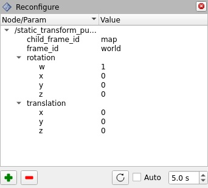
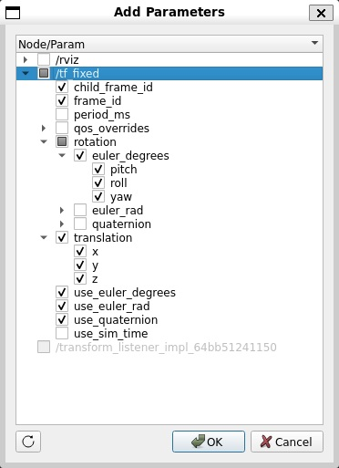

# [rviz2_reconfigure](https://github.com/shikishima-TasakiLab/rviz2_reconfigure)

Parameter reconfigure for RViz2.

| Panel | Dialog |
| :--- | :--- |
|  |  |

Verified to work with ros2 humble (2026/02/28).

## Supported Parameter Types

- bool
- int64
- float64
- string

The following types are not supported.

- byte[]
- bool[]
- int64[]
- float64[]
- string[]

## Install

```bash
cd /your_ros2_ws/src/
git clone https://github.com/shikishima-TasakiLab/rviz2_reconfigure.git
cd ..
colcon build
source install/setup.bash
```

## Panel


Double-click the "Value" column to edit the parameter value.

| Command | Overview |
| :--- | :--- |
|  Add | Add parameters to the list. |
|  Remove | Remove the selected parameter from the list. |
|  Import | Import and set parameters stored in YAML. Parameters not in the list or parameters of unsupported types will be ignored. |
|  Export | Export parameters from the list. Parameters of unsupported types will be ignored. |
|  Refresh | Retrieve and refresh the current parameter values. |
| Auto | If you check the checkbox, the parameter values in the list will be automatically refreshed at the interval specified in the spin box. |

## Add Parameters Dialog


Check the checkbox for the parameter you want to add to the list.

| Command | Overview |
| :--- | :--- |
|  Refresh | Refresh the list of nodes and parameters. |
| OK | Add the checked parameters to the list within the panel. |
| Cancel | Close the screen without doing anything. |

## Contributor

- Google Gemini
